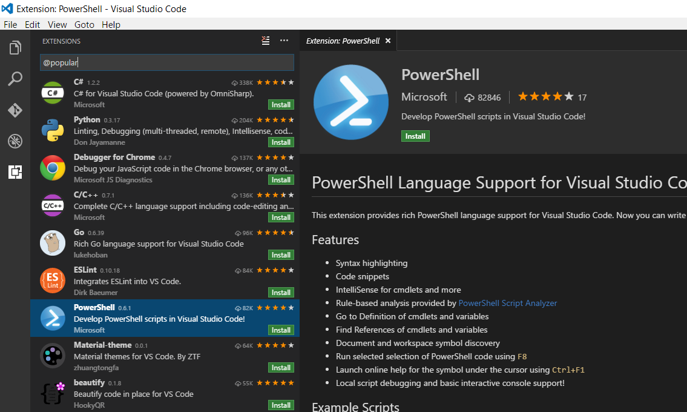

Using Visual Studio Code for PowerShell Development
====

If you are working on Linux and macOS, you cannot use the PowerShell ISE because it is not supported on these platforms.
In this case, you can choose your favorite editor to write PowerShell scripts.
Here we choose Visual Studio Code as a PowerShell editor.

You can use Visual Studio Code on Windows with PowerShell version 5 by using Windows 10 or by installing [Windows Management Framework 5.0 RTM](https://www.microsoft.com/en-us/download/details.aspx?id=50395) for down-level Windows OSs (e.g. Windows 8.1, etc.).

Before starting it, please make sure PowerShell exists on your system.
By following the [Installing PowerShell](./README.md#installing-powershell) instructions you can install PowerShell and launch a PowerShell session.

Editing with Visual Studio Code
----
[**1. Installing Visual Studio Code**](https://code.visualstudio.com/Docs/setup/setup-overview)

* **Linux**: follow the installation instructions on the [Running VS Code on Linux](https://code.visualstudio.com/docs/setup/linux) page

* **macOS**: follow the installation instructions on the [Running VS Code on macOS](https://code.visualstudio.com/docs/setup/osx) page

* **Windows**: follow the installation instructions on the [Running VS Code on Windows](https://code.visualstudio.com/docs/setup/windows) page


**2. Installing PowerShell Extension**

-	Launch the Visual Studio Code app by:    
  *	**Windows**:      typing **code** in your PowerShell session
  *	**Linux**:        typing **code .** in your terminal
  *	**macOS**:         typing **code** in your terminal


-	Press **F1** (or **Ctrl+Shift+P**) which opens up the "Command Palette" inside the Visual Studio Code app.
-	In the command palette, type **ext install** and hit **Enter**. It will show all Visual Studio Code extensions available on your system.
-	Choose PowerShell and click on **Install**, you will see something like below



-	After the install, you will see the **Install** button turns to **Enable**.
-	Click on **Enable** and **OK**
-	Now you are ready for editing.
For example, to create a new file, click **File->New**.
To save it, click **File->Save** and then provide a file name, let's say "helloworld.ps1".
To close the file, click on "x" next to the file name.
To exit Visual Studio Code, **File->Exit**.

#### Using a specific installed version of PowerShell

If you wish to use a specific installation of PowerShell with Visual Studio Code,
you will need to add a new variable to your user settings file.

1. Click **File -> Preferences -> User Settings**
2. Two editor panes will appear.  In the right-most pane (`settings.json`), insert the setting below
   appropriate for your OS somewhere between the two curly brackets (`{` and `}`) and replace *<version>*
   with the installed PowerShell version:

  ```json
    // On Windows:
    "powershell.developer.powerShellExePath": "c:/Program Files/PowerShell/<version>/powershell.exe"

    // On Linux:
    "powershell.developer.powerShellExePath": "/opt/microsoft/powershell/<version>/powershell"

    // On macOS:
    "powershell.developer.powerShellExePath": "/usr/local/microsoft/powershell/<version>/powershell"
  ```

3. Replace the setting with the path to the desired PowerShell executable
4. Save the settings file and restart Visual Studio Code

Debugging with Visual Studio Code
----

-	Open a file folder (**File->Open Folder**) that contains the PowerShell modules or scripts you have written already and want to debug.
In this example, we saved the helloworld.ps1 under a directory called "demo".
Thus we select the "demo" folder and open it in Visual Studio Code.

-	Creating the Debug Configuration (launch.json)

  Because some information regarding your scripts is needed for debugger to start executing your script, we need to set up the debug config first.
  This is one-time process to debug PowerShell scripts under your current folder.
  In our case, the "demo" folder.

  * Click on the **Debug** icon (or **Ctrl+Shift+D**)
  * Click on the **Settings** icon that looks like a gear.
  Visual Studio Code will prompt you to **Select Environment**.
Choose **PowerShell**.
Then Visual Studio Code will auto create a debug configuration settings file in the same folder.
It looks like the following:
```json
{
    "version": "0.2.0",
    "configurations": [
        {
            "name": "PowerShell",
            "type": "PowerShell",
            "request": "launch",
            "program": "${file}",
            "args": [],
            "cwd": "${file}"
        }
    ]
}
```
-	Once the debug configuration is established, go to your helloworld.ps1 and set a breakpoint by pressing **F9** on a line you wish to debug.
-	To disable the breakpoint, press **F9** again.
-	Press **F5** to run the script.
The execution should stop on the line you put the breakpoint on.
- Press **F5** to continue running the script.

There are a few blogs that may be helpful to get you started using PowerShell extension for Visual Studio Code

-	Visual Studio Code: [PowerShell Extension][ps-extension]
-	[Write and debug PowerShell scripts in Visual Studio Code][debug]
-	[Debugging Visual Studio Code Guidance][vscode-guide]
-	[Debugging PowerShell in Visual Studio Code][ps-vscode]


[ps-extension]:https://blogs.msdn.microsoft.com/cdndevs/2015/12/11/visual-studio-code-powershell-extension/
[debug]:https://blogs.msdn.microsoft.com/powershell/2015/11/16/announcing-powershell-language-support-for-visual-studio-code-and-more/
[vscode-guide]:https://johnpapa.net/debugging-with-visual-studio-code/
[ps-vscode]:https://github.com/PowerShell/vscode-powershell-ops/tree/master/vscode-powershell/examples

PowerShell Extension for Visual Studio Code
----

The PowerShell extension's source code can be found on [GitHub](https://github.com/PowerShell/vscode-powershell-ops).
